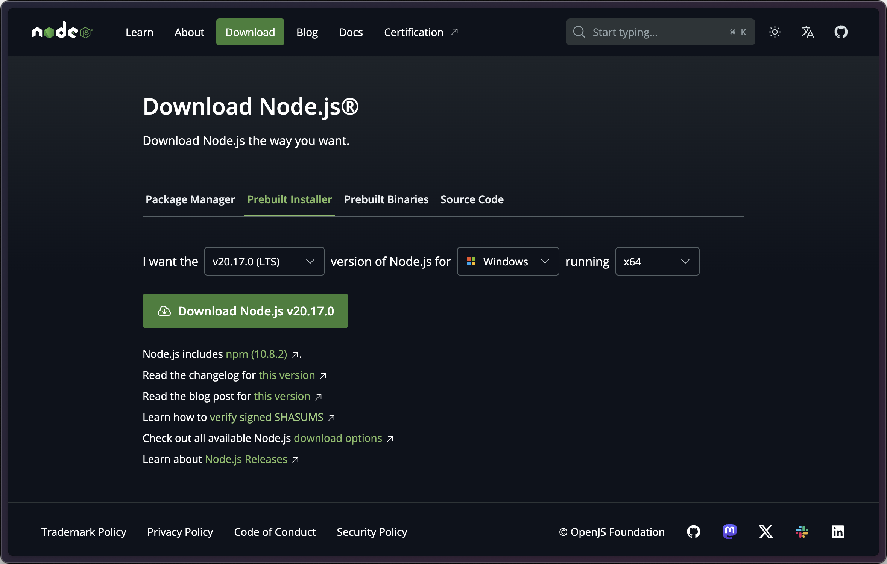

# Node Demo

#### ⚠️ Warning: Terminal commands are written for UNIX systems (macOS/Linux).

## Downloading Node

- [NodeJS](https://nodejs.org/en/download/prebuilt-installer) (this will download node and npm)


To minimize environment errors lets all download `v20.17.0`

You can validate node and npm have been installed by running this.

```sh
node --version
npm --version
```

## Introduction to Coding in JavaScript

1. Open your terminal and run a command like this to create and navigate to a directory for this script.

```sh
mkdir ~/Documents/node-demo/
cd ~/Documents/node-demo/
```
Run `pwd` to confirm you're in the new directory

2. Now open the directory in your code editor.

```sh
code .
```

3. Create a file called `index.js` and paste this code inside.

```JavaScript
let a = 1;
let b = 2;
let c = Math.max(a, b); // this uses the Math module's max function

console.log(c);
```

4. Now go back to your terminal and run this.

```sh
node index.js
```

5. You should see this output.

```sh
2
```

## Adding Packages and Scripts

1. In the same `node-demo` directory from the previous section run this.

```sh
npm init -y
```

This initializes the project and allows you to add packages to it. It also lets you run scripts with a command like `npm run dev`.

2. You should see a new file in the directory called `package.json`. Inside this file make these changes.

```json
...
"scripts": {
    ...
    "start": "node index.js",
},
...
```
Make sure you add a comma after each line in the `scripts` object.

3. In your terminal run this command and you should see the same output from before, but with some added package info (this comes from package.json). 
```sh
npm run start
```

4. Create a new file called `index.mjs`. This is where we can add packages to our code.

5. In your terminal run this line to install [Chalk](https://www.npmjs.com/package/chalk). (make sure your pwd is the same directory with `package.json`)
```sh
npm install chalk
```

6. In `index.mjs` paste this code.
```JavaScript
import chalk from 'chalk';

console.log(chalk.blue('Hello world!'));
```

7. Either run the new module with `node index.mjs` or modify `package.json` like this to run the module with `npm run module`.
```json
...
"scripts": {
    ...
    "module": "node index.mjs",
},
...
```
```sh
node index.mjs
```
```sh
npn run module
``` 

### [JavaScript Cheat Sheet](https://cheatsheets.zip/javascript)